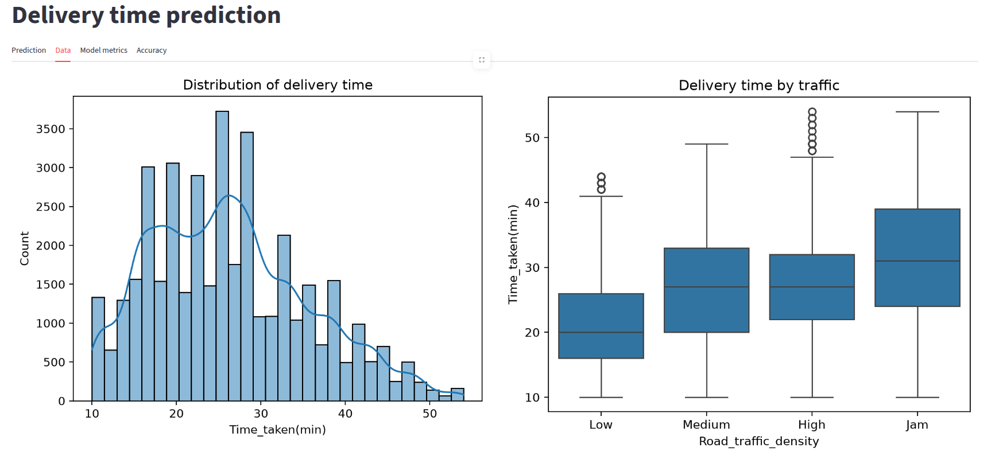
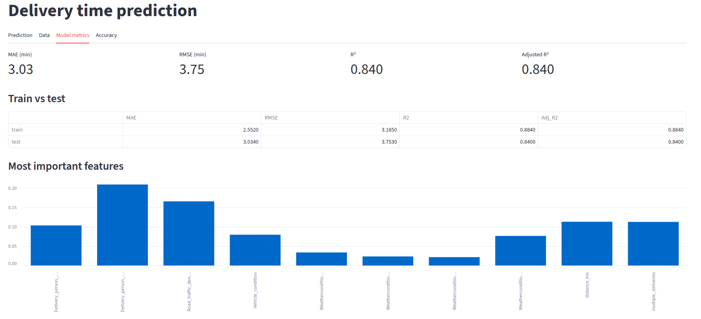
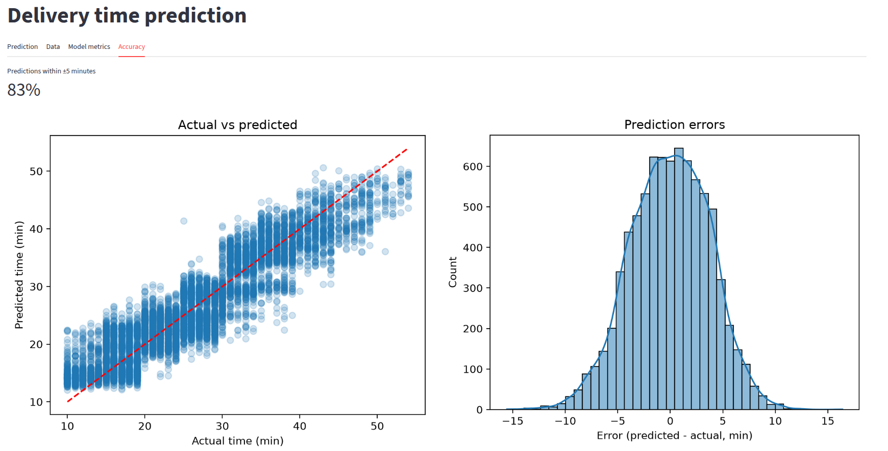

# DeliveryETA: Delivery Time Prediction

Predict how many minutes a food delivery will take, from the order until it arrives, so the company can give customers a realistic ETA, plan its riders better, and understand what makes deliveries slower.

- **Jira board:** `<paste your Jira link here>`
- **Author:** Amine
- **Task type:** supervised regression (target: `Time_taken(min)`)

## Results

The final model is a **tuned Random Forest** inside a scikit-learn Pipeline.

| Metric (test set) | Value |
|---|---|
| MAE | **3.03 min** |
| RMSE | 3.75 min |
| R² | 0.840 |
| Adjusted R² | 0.840 |

**In business words:** the model is off by about 3 minutes on average, and it explains 84% of the variation in delivery time. 83% of test predictions are within 5 minutes of the real time.

Train R² is 0.884 and test R² is 0.840. The gap is small, so overfitting is under control.

### Model comparison (same train/test split)

| Model | MAE | RMSE | R² (test) |
|---|---|---|---|
| Linear Regression | 4.81 | 6.01 | 0.590 |
| Ridge | 4.81 | 6.01 | 0.590 |
| Decision Tree | 4.02 | 5.23 | 0.689 |
| Random Forest | 3.11 | 3.87 | 0.830 |
| **Random Forest (tuned)** | **3.03** | **3.75** | **0.840** |

- Linear models are too simple (train R² = test R² = 0.59): they cannot capture combined effects such as heavy traffic together with a long distance.
- The single Decision Tree memorizes the training data (train R² = 1.00, test R² = 0.69).
- Random Forest averages many trees, so it generalizes much better. Tuning (RandomizedSearchCV, 15 candidates, 3-fold CV) reduced the train/test gap from 0.146 to 0.044.
- Best settings: `n_estimators=300`, `max_depth=15`, `min_samples_leaf=5`, `max_features=0.5`.

## Dataset

`Food_delivery.csv`: 45,593 deliveries with rider info (ID, age, rating), restaurant and customer GPS coordinates, date and times, weather, traffic, vehicle type and condition, order type, number of deliveries in the same trip, festival flag, city type, and the real delivery time.

## Approach

### 1. Cleaning (`src/cleaning.py`)
| Problem found | Decision | Why |
|---|---|---|
| Extra spaces in text values | `strip()` | `"High "` and `"High"` would be two different categories |
| Missing values hidden as the text `"NaN"` (sometimes inside `"conditions NaN"`) | Convert to real missing values | `isnull()` cannot see them |
| Text prefixes (`"conditions Sunny"`, `"(min) 24"`) | Remove the prefix, convert to numbers | The target must be numeric |
| Missing age and rating | Median | Median is not moved by extreme values |
| Missing categories and `multiple_deliveries` | Mode | Numbers like an average make no sense for labels |
| Missing order time (3.8%) | Drop the rows | A clock time cannot be guessed, and we need it for a feature |
| Negative latitude values (sign errors) | `abs()` | The value is right, only the sign is wrong |
| Coordinates near 0 (impossible for India) | Drop the rows | Cannot be repaired, and they would ruin the distance feature |
| Delivery times above the IQR limit (255 rows) | Keep | All values are realistic (10 to 54 min) and slow deliveries are exactly what we want to explain |
| Duplicates | Drop | |

About 40,350 rows remain after cleaning.

### 2. Exploration and features (`src/features.py`)
- Delivery time is slightly right-skewed (skewness 0.48), so no transformation was needed. It has two humps, mostly explained by traffic.
- Strongest links with delivery time: `multiple_deliveries` (+0.38), rider rating (-0.36), `distance_km` (+0.32), rider age (+0.30), vehicle condition (|r| = 0.24).
- Traffic, weather, festival days and semi-urban cities also change delivery time. Order type and vehicle type have almost no effect.
- **New features:**
  - `distance_km`: real distance between restaurant and customer (haversine formula, because raw latitude/longitude are angles, not flat coordinates).
  - `prep_time_min`: time between order and pickup. It has almost no correlation with delivery time (its values are only 5, 10 or 15 minutes, which suggests the timestamps were generated synthetically).

### 3. Modeling (`src/train.py`)
- Encoding: traffic is ordinal (Low < Medium < High < Jam), the other categories are one-hot encoded with `drop_first=True`.
- 80/20 train/test split (`random_state=42`).
- A scikit-learn `Pipeline` (`StandardScaler` on the 4 continuous columns, then the model) so the scaler learns only from training data.
- Model, scaler and column list are saved with joblib.

## Project structure

```
delivery-eta-prediction/
├── data/
│   ├── raw/                 # Food_delivery.csv (original, untouched)
│   └── processed/           # clean_data.csv
├── notebooks/
│   └── 01_exploration.ipynb # full commented analysis
├── src/
│   ├── cleaning.py          # data cleaning
│   ├── features.py          # feature engineering and encoding
│   ├── train.py             # training, evaluation, saving
│   └── predict.py           # inference with input checks
├── models/                  # final_model.joblib, scaler.joblib, feature_columns.joblib, metrics
├── app/
│   └── streamlit_app.py     # web app
├── screenshots/
├── requirements.txt
└── README.md
```

## Installation and usage

```bash
python -m venv .venv
source .venv/bin/activate          # Windows: .venv\Scripts\activate
pip install -r requirements.txt
```

Rebuild the data and the model from the raw CSV:

```bash
python -m src.train
```

Start the app:

```bash
streamlit run app/streamlit_app.py
```

## The app

The app has four tabs: prediction (inputs and estimated minutes with a likely range), data visualizations, model metrics (with train vs test and feature importance), and model accuracy (actual vs predicted, error distribution).

| Prediction | Data |
|---|---|
|  |  |

| Model metrics | Accuracy |
|---|---|
|  |  |

## Limitations

- Median and mode values for missing data were computed on the full dataset before the train/test split. This is a mild form of leakage. Scaling and modeling are inside the Pipeline and are split correctly.
- `City = Semi-Urban` has only 141 rows and `Festival = Yes` only 787, so the model learns less reliably for them.
- `prep_time_min` carries almost no signal in this dataset.
- The model was trained on one dataset from one period, so its errors on other cities or seasons are unknown.

## Possible next steps

FastAPI endpoint for the model, MLflow experiment tracking, an Airflow workflow to retrain automatically, and SHAP values to explain single predictions.